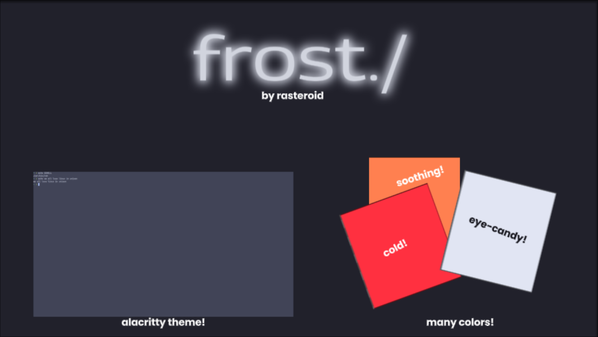

# frost
## Frost is a palette of cold-warm colors with a icy tune to it.
they mostly consist of "normal" colors but in a cooler tone and a bit more brighter to match the icy consistency.

WARNING: It is strongly recommended to download the Yaru-blue icon themes in nwg-look. Commonly i assume you use arch btw.
`yay -S humanity-icon-theme yaru-colors-gtk-theme --noconfirm`
>> humanity-icon-theme is a important dependency to render the icons correctly in Arch Linux.

### Assuming you might not even use arch, here are some alternative commands:
fedora
`sudo dnf install yaru-icon-theme`

debian/ubuntu
`sudo apt update
sudo apt install yaru-theme-icon`

void
`sudo xbps-install -Sy yaru-theme`

in case you don't have nwg-look or "GTK Settings" installed, install it with
`sudo pacman -S --noconfirm nwg-look`.
optionally, install GTK. today we will use gtk3.
`sudo pacman -S --noconfirm gtk3`. In nwg-look, go to Icon Theme and select Yaru-blue

### for the other distros btw:
fedora
`sudo dnf install nwg-look`
`sudo dnf install gtk3`

ubuntu/debian
`sudo apt update && sudo apt install nwg-look libgtk-3-dev`

void
`sudo xbps-install -Sy nwg-look gtk3`
### sadly nwg-look is probably only found in newer versions of Ubuntu/Debian. if you have a older version (before Debian 13, or before Ubuntu 24.04 LTS)

well, cant use nwg-look? just use your desktop environment's appearance settings!

>> all of this was about the Yaru-blue icon theme and nwg-look so you can set Yaru-blue. Frost itself is not a icon theme but a color palette. see in the file tree. 
_____________________________________________________

